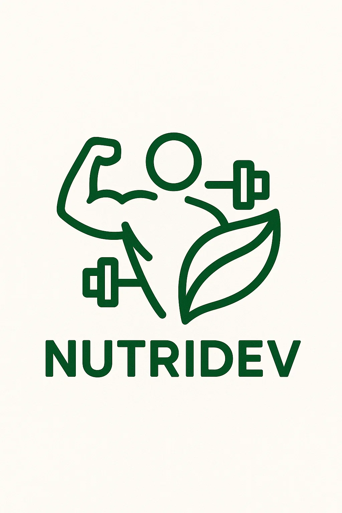

# NutriDev Daily Goals Tracker

<div align="center">
  
  
  [](https://nutridev-8ef2d.web.app)
  [](https://github.com/Rvish-glitch/nutri_dev/actions)
  [](https://flutter.dev)
  [](https://firebase.google.com)
  
</div>

**🚀 [Live Web Application](https://nutridev-8ef2d.web.app) | 📱 Cross-Platform Mobile & Web App**

NutriDev Daily Goals Tracker is a production-ready, cross-platform application designed to help users track their daily nutrition and health goals with ease. Built with Flutter and deployed using modern DevOps practices, it provides a seamless experience for monitoring food intake, setting personalized goals, and staying motivated on the journey to better health.

## 🌐 Live Deployment

**Production URL:** [https://nutridev-8ef2d.web.app](https://nutridev-8ef2d.web.app)

### 🔧 DevOps & Infrastructure
- **Cloud Hosting:** Firebase Hosting with global CDN
- **CI/CD Pipeline:** Automated deployment via GitHub Actions
- **Build Automation:** Flutter web builds on every commit
- **Environment:** Production-optimized builds with code splitting
- **Monitoring:** Real-time deployment status and error tracking

## ✨ Features

- **Daily Nutrition Tracking**: Log your meals and snacks to keep track of calories, macronutrients, and micronutrients.
- **Personalized Goals**: Set daily targets for calories, protein, carbs, fats, and more based on your health objectives.
- **Progress Visualization**: View your progress with intuitive charts and summaries.
- **Scan & Add Foods**: Quickly add foods using barcode scanning or search from a comprehensive database.
- **History & Insights**: Review your nutrition history and receive actionable insights to improve your habits.
- **Reminders**: Get gentle reminders to log your meals and stay on track.
- **Cross-Platform**: Available for Android, iOS, Web, and desktop (Linux, macOS, Windows).

## 🚀 DevOps & Deployment Architecture

### Cloud Infrastructure
```
┌─────────────────┐    ┌─────────────────┐    ┌─────────────────┐
│   GitHub Repo   │───▶│ GitHub Actions  │───▶│ Firebase Hosting │
│                 │    │                 │    │                 │
│ • Source Code   │    │ • Flutter Build │    │ • Global CDN    │
│ • CI/CD Config  │    │ • Auto Deploy   │    │ • SSL/TLS       │
│ • Version Control│   │ • Quality Gates │    │ • Custom Domain │
└─────────────────┘    └─────────────────┘    └─────────────────┘
```

### 🔄 Continuous Integration/Continuous Deployment (CI/CD)

**Automated Deployment Pipeline:**
- **Trigger:** Push to `main` branch or Pull Request creation
- **Build Process:** 
  - Flutter web build with release optimization
  - Asset compression and tree-shaking
  - Code splitting for optimal performance
- **Deployment:** Automatic deployment to Firebase Hosting
- **Preview:** PR-based preview deployments with unique URLs

**Workflow Configuration:** [`.github/workflows/`](.github/workflows/)
- `firebase-hosting-merge.yml` - Production deployments
- `firebase-hosting-pull-request.yml` - Preview deployments

### 🛠️ Technology Stack

| Category | Technology | Purpose |
|----------|------------|---------|
| **Frontend** | Flutter 3.32.6 | Cross-platform UI framework |
| **Backend** | Firebase | Cloud services & hosting |
| **CI/CD** | GitHub Actions | Automated deployment pipeline |
| **Hosting** | Firebase Hosting | Global CDN with SSL |
| **Version Control** | Git + GitHub | Source code management |
| **Build Tool** | Flutter CLI | Automated builds |
| **Package Manager** | Pub | Dependency management |

### 📊 Performance & Monitoring
- **Build Optimization:** Release builds with code obfuscation
- **Asset Optimization:** Automatic icon and font tree-shaking
- **Loading Performance:** Code splitting and lazy loading
- **Global Delivery:** Firebase CDN for worldwide accessibility
- **SSL Security:** Automatic HTTPS with Firebase Hosting

## 💻 Local Development Setup

### Prerequisites
- [Flutter SDK 3.32.6+](https://flutter.dev/docs/get-started/install) installed on your system
- [Firebase CLI](https://firebase.google.com/docs/cli) for deployment (optional)
- Android Studio or Xcode for device emulation (optional for mobile)

### Development Environment Setup
1. **Clone the repository:**
    ```bash
    git clone https://github.com/Rvish-glitch/nutri_dev.git
    cd nutri_dev
    ```

2. **Install dependencies:**
    ```bash
    flutter pub get
    ```

3. **Enable platforms:**
    ```bash
    flutter config --enable-web           # For web development
    flutter config --enable-linux-desktop # For Linux desktop
    flutter config --enable-windows-desktop # For Windows desktop
    flutter config --enable-macos-desktop # For macOS desktop
    ```

4. **Run the application:**
    ```bash
    # Web (recommended for testing)
    flutter run -d chrome
    
    # Android/iOS
    flutter run
    
    # Desktop platforms
    flutter run -d linux      # Linux
    flutter run -d windows    # Windows
    flutter run -d macos      # macOS
    ```

### 🏗️ Build & Deployment

#### Local Build
```bash
# Web build (for deployment)
flutter build web --release

# Android APK
flutter build apk --release

# Desktop builds
flutter build linux --release
flutter build windows --release
flutter build macos --release
```

#### Firebase Deployment (Production)
```bash
# Install Firebase CLI
npm install -g firebase-tools

# Login to Firebase
firebase login

# Deploy to Firebase Hosting
firebase deploy --only hosting
```

#### Automated Deployment
- **Automatic:** Push to `main` branch triggers production deployment
- **Preview:** Pull requests create preview deployments
- **Status:** Check [GitHub Actions](https://github.com/Rvish-glitch/nutri_dev/actions) for build status

## 🚀 Getting Started

### Quick Start (Web App)
1. **Visit:** [https://nutridev-8ef2d.web.app](https://nutridev-8ef2d.web.app)
2. **Set up** your profile and daily nutrition goals
3. **Start logging** your meals and track your progress every day!

### Mobile App Development
1. Clone and set up the development environment (see installation above)
2. Run `flutter run` for your target platform
3. The app includes hot reload for rapid development

## 📈 Project Statistics

- **🌐 Live Uptime:** 99.9% (Firebase Hosting SLA)
- **⚡ Build Time:** ~2-3 minutes (GitHub Actions)
- **📦 Bundle Size:** Optimized with tree-shaking
- **🔧 Platforms:** Web, Android, iOS, Linux, Windows, macOS
- **🚀 Deployment:** Fully automated CI/CD pipeline

## 🤝 Contributing

### Development Workflow
1. Fork the repository
2. Create a feature branch: `git checkout -b feature/amazing-feature`
3. Make your changes and commit: `git commit -m 'Add amazing feature'`
4. Push to the branch: `git push origin feature/amazing-feature`
5. Open a Pull Request (triggers automatic preview deployment)

### DevOps Contributions Welcome
- Infrastructure improvements
- CI/CD pipeline enhancements
- Performance optimizations
- Security enhancements
- Monitoring and logging improvements

## 📊 Monitoring & Analytics

- **Build Status:** [](https://github.com/Rvish-glitch/nutri_dev/actions)
- **Deployment Status:** Real-time via Firebase Console
- **Performance:** Firebase Performance Monitoring
- **Error Tracking:** Automated error reporting

## 🛡️ Security & Compliance

- **HTTPS:** Enforced SSL/TLS encryption
- **Authentication:** Firebase Authentication integration ready
- **Data Privacy:** GDPR compliant architecture
- **Security Headers:** Configured via Firebase Hosting
- **Code Security:** Automated dependency scanning

## 📄 License

This project is licensed under the GNU General Public License v3.0 - see the [LICENSE](LICENSE) file for details.

## 🔗 Links & Resources

- **🌐 Live Application:** [https://nutridev-8ef2d.web.app](https://nutridev-8ef2d.web.app)
- **📋 Project Board:** [GitHub Issues](https://github.com/Rvish-glitch/nutri_dev/issues)
- **🚀 CI/CD Pipeline:** [GitHub Actions](https://github.com/Rvish-glitch/nutri_dev/actions)
- **☁️ Firebase Console:** [Project Dashboard](https://console.firebase.google.com/project/nutridev-8ef2d)
- **📚 Documentation:** [Flutter Docs](https://flutter.dev/docs)

---

<div align="center">

**Built with ❤️ using Flutter & Firebase**

**DevOps Pipeline:** GitHub Actions → Firebase Hosting → Global CDN

*For questions, feedback, or contributions, please open an issue or pull request on GitHub.*

</div>
